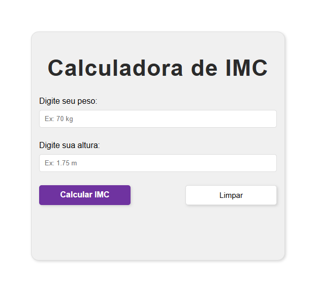

# BMI Calculator 🧮

This is my first JavaScript project — a simple **BMI (Body Mass Index) Calculator** built using **HTML**, **CSS**, and **JavaScript**.  
It calculates a person's BMI based on weight and height inputs and provides feedback on their weight category.

## ✨ Features
- User-friendly interface with clean and responsive design.
- Real-time input formatting (replaces commas with dots for decimal values).
- Calculates BMI using the formula: BMI = weight / (height * height)
- Provides clear feedback messages based on the BMI range.
- Includes a **clear** button to reset inputs and results.

## 📚 What I Learned
While developing this project, I learned:
- **DOM Manipulation**: Selecting elements, changing their values, and updating the HTML content dynamically.
- **Functions in JavaScript**: Creating reusable blocks of code for calculations and input clearing.
- **Event Handling**: Using `onsubmit` and `onclick` to trigger actions.
- **Form Validation Basics**: Preventing default form submission to handle data in JavaScript.
- **CSS Styling**: Applying layouts, responsive design, and hover effects.

## 🖥️ Technologies Used
- **HTML5** — for the structure
- **CSS3** — for styling and responsiveness
- **JavaScript (Vanilla)** — for logic and interactivity

## 📷 Preview

## 🚀 How to Use
- **Option 1:** Open the project directly in your browser: [https://simeimoda.github.io/Altgram-login-page/index.html](https://simeimoda.github.io/BMI-Calculator/)
- **Option 2**: Clone the repository and open `index.html` in a browser.

